# CLEAR-ATS · v10 — User Guide

CLEAR-ATS (Clean Energy Automated Road Transport System) is an interactive dashboard that projects the energy demand and CO₂ emissions of road transport from 2024 onward, with full quantitative resolution for **California** and **Ohio**. It accompanies the manuscript *Traffic Autonomy Expansion Shifts Marginal Energy Costs from Vehicles and Infrastructure to AI Computing and Electricity*.

The dashboard separates two kinds of energy:

- **One-Time Energy** — production, logistics, and end-of-life accounting for the autonomy hardware (cameras, LiDARs, radars, compute units, V2X modules, roadside sensors).
- **Utility-Phase Energy** — annual operational energy of the vehicle and roadside fleet (propulsion + the AV subsystems: sensing, computing, communication).

> **v10 in one line.** Utility-phase energy is now built bottom-up from a per-component registry (deployed automotive silicon × component counts × duty cycle × utilization × scenario factor), not from the flat per-level aggregates used in v3–v9. The autonomy stack now sits in the realistic **1–25 %** range observed in fielded CAVs.

---

## What You Can Do on This Site

| If you want to… | Go to | Use |
|---|---|---|
| See which autonomy hardware components carry the largest embodied energy | One-Time Energy | Figure A, B, C |
| Understand how upgrading a vehicle from L3 → L5 changes its embodied energy | One-Time Energy | Figure B + "L3 Small → L5 multiplier" KPI |
| Quantify the leverage of sensor refurbishment vs. compute reuse | One-Time Energy | End-of-Life Leverage tornado plot |
| Compare ICE vs. BEV running energy at each autonomy level | Utility Phase Energy | Figure 1 (stacked bars) |
| See per-unit AV-subsystem energy on its own (no propulsion) | Utility Phase Energy | AV subsystem breakdown |
| Project state-scale CO₂ or energy through 2075 under your assumptions | Scenario Explorer | Figure A trajectory |
| Identify which input parameter dominates residual uncertainty in 2030 / 2050 / 2075 | Scenario Explorer | Figure B (top drivers) |
| Compare California vs. Ohio | Scenario Explorer | Sidebar → **Scope → Region** |
| Test a policy lever (BEV growth, low-carbon electricity growth, hardware-efficiency doubling time) | Scenario Explorer | Sidebar sliders |
| Switch between residual-only and full-scenario uncertainty | Scenario Explorer | Figure A → **Uncertainty object** |
| Inspect every factor's source and prior distribution | Any page → Factor specification / Component registry expanders |

---

## Page 1 — Overview

The landing page. Reads as a short briefing: framework purpose, scope (California + Ohio, 2024 →). The framework uncertainty diagram explains how Data Uncertainty → State-level Condition Uncertainty → Utility-Phase Uncertainty → Cumulative Results propagate to the headline ranges (e.g., "by 2075 the 5–95 % interval exceeds half of the median").

Use it as a map; the analysis happens on the next three pages.

---

## Page 2 — One-Time Energy

> Production + logistics + end-of-life accounting for the autonomy hardware. No operational energy here.

### Figure A — Component-level one-time energy ranking
Horizontal bar chart of per-unit embodied energy (kWh) for every component in the registry, ranked high → low. Colours encode subsystem: **blue = sensing, gray = computing, red = communication**. Circle markers (●) are CAV components; triangle markers (▲) are STI (roadside) components.

- **HP Computing Unit** (654.3 kWh) and **Static HP LiDAR** (607.6 kWh) top the ranking per unit.
- But individual ranking is *deceptive*: sensors are deployed in much higher counts, so sensing dominates the totals you see in Figure B.

### Figure B — Unit one-time energy with subsystem decomposition
Horizontal stacked bars for each unit type (CAV L3 Small/Medium/Large, L4, L5; STI Basic, Semi, Highly). In-bar labels are the subsystem share; the right-hand label is the total in kWh.

- **Sensing dominates** every unit type (~76–91 %).
- A Level 5 CAV costs ≈ **3.56×** the production+logistics energy of an L3 Small CAV.
- A discrepancy note is surfaced explicitly for "STI Basic" (2,747 vs 2,140 kWh) so the reader can compare both aggregation paths.

### Figure C — Marginal components across autonomy levels
Stacked bar of the *additional* hardware items autonomy introduces per unit, beyond a conventional vehicle / intersection. Sourced from manuscript Extended Data Tables 3 & 4.

- **Toggle:** *Component breakdown (default)* vs *Total counts only.*
- L3 Small uses 12 sonars to compensate for missing LiDAR; L3 Medium swaps to 2× LiDAR S; L3 Large drops sonar entirely. Total count drops L3 Small → Large but per-unit energy rises — Figure B and Figure C tell complementary stories.

### Live derived metrics (KPIs)
For a fixed representative fleet (10×L3-Small, 5×L3-M, 2×L3-L, 1×L4, 1×L5 CAVs + 5×Basic, 2×Semi, 1×Highly STIs):

- Production + logistics: **112.8 MWh**
- Sensing share (fleet-weighted): **81.5 %**
- L3 Small → L5 multiplier: **3.56×**
- End-of-life energy savings: **48.25 MWh (-42.8 %)**

### L5 cross-check panel
Compares the manuscript's L5 annual utility figure (18,232 kWh/yr, pre-recalibration) against the registry value (**1,048 kWh/yr**, a −94.3 % correction). Two donut charts show:
- L5 production + logistics split (sensing 88 %, computing 9 %, communication 3 %)
- L5 utility-phase autonomy split (computing 71 %, sensing 29 %, communication negligible)

### End-of-Life Leverage tornado plot
Each row shows how much fleet one-time energy moves when one *design action* is taken to its lower or upper bound while the others stay at baseline:

1. Sensing refurbishment rate (0–100 %)
2. Sensing manufacturing efficiency improvement (0–60 %)
3. Sensor service-life extension (12 → 20 yr)
4. Computing refurbishment adoption (0–100 %)

Green bars reduce burden, red bars raise it. Sensing-side actions dominate because sensing dominates the burden.

---

## Page 3 — Utility Phase Energy

> Annual running energy at the *unit* level. State-scale projections live on the Scenario Explorer page.

### Controls you can change
- **Emission-factor region** (config: California / Ohio)
- **CAV duty cycle**: *Personal use (~3 h/day)* or *Robotaxi (~12 h/day)* — sensitivity toggle
- **ICE propulsion (kWh/yr)** numeric input
- **BEV propulsion (kWh/yr)** numeric input

Propulsion values are **entered**, not back-solved. Whatever you type becomes the propulsion bar; the AV stack is computed independently from the component registry and stacked on top.

### Figure 1 — Annual running energy, per vehicle
Stacked bars for ICE L3 / L4 / L5 and BEV L3 / L4 / L5, in MWh/yr. Each bar's right-side label shows total energy and the **% AV share**.

- ICE vehicles: autonomy stack is **1.5 – 11 %** of the total.
- BEV vehicles: autonomy stack rises to **~23 %** at L5 because the propulsion baseline is smaller.
- Moving L3 → L5 raises the per-vehicle AV burden ≈ **8×**, driven by compute scaling (FSD-class → DRIVE Orin → DRIVE Thor) and doubled compute-unit counts.

### AV subsystem breakdown (no propulsion)
Two side-by-side charts:
- **CAV units** (ICECAV and ECAV at L3/L4/L5) — values 0.13 → 1.68 MWh/yr.
- **STI levels** (Basic / Semi / Highly) — values 1.89 → 14.27 MWh/yr.

STI is ~10× a CAV at the same coverage level because STI runs **24/7** with an extensive roadside sensor inventory.

### Component power registry 
Expandable table of every per-component power range, its evidence tier (manuscript, vendor_estimate, assumption), and the Monte Carlo prior actually propagated downstream. Triangular ranges for weaker-tier components are widened (×1.25 / ×1.5) before sampling.

### Legacy v9 factors (collapsed)
The flat ECAV / STI load factors used by v3–v9 are still shown for continuity but are superseded by the registry above.

---

## Page 4 — Scenario Explorer

> State-scale utility-phase projections through 2075. The most interactive page — almost every figure responds to the sidebar.

### Sidebar — Scope
- **Region** — California / Ohio.
- **Policy** — Baseline / *(policy presets defined in the config)*.
- **Default residual band** — Default / Customized (toggle between manuscript ranges and your own).
- **State weather profile** — expandable.

### Sidebar — Scenario settings (the levers)
| Setting | Default | Range | What it means |
|---|---|---|---|
| **CAV target fraction by 2075** | 0.45 | 0.00 – 0.95 | Final share of vehicles that are connected/automated |
| **STI coverage target by 2075** | 0.50 | 0.00 – 0.95 | Final share of intersections upgraded to smart infrastructure |
| **Annual BEV-share growth** | 0.07 | 0.00 – 0.50 | Compound growth rate of BEV penetration |
| **Annual low-carbon electricity share growth** | 0.05 | 0.00 – 0.30 | Compound growth of clean grid share |
| **Hardware efficiency doubling time (yr)** | 2.80 | 2.00 – 12.00 | How fast deployed autonomy silicon improves (smaller = faster) |
| **Hardware deployment lag (yr)** | 2.00 | 0.00 – 5.00 | Delay between best-available and fleet-deployed efficiency |

Click **Reset to state defaults** to return to the region's canonical scenario.

### Figure A — ATS trajectory (the central plot)
A time series from 2024 to 2075. Choose:

- **Metric**: Annual CO₂, Annual energy, Both (dual axis), Cumulative CO₂, Cumulative energy.
- **Uncertainty object**:
  - *Residual* — uncertainty *given* your chosen scenario settings (decision-focused).
  - *Scenario envelope* — wider band that also varies the scenario settings (reviewer-facing).
- **Monte Carlo runs** — 20 / 80 / 200 samples (more samples = smoother band, slower).

Live KPIs below the toggles report **Peak year**, **Turning year**, and intervention-band crossings at τ = 0.5 and τ = 1.5.

### Figure B — Top residual-uncertainty drivers
Horizontal bar chart of `(p95 − p05) / p50` for each factor, sampled one-at-a-time with all others fixed. Pick the **Year** (2030 / 2050 / 2075). Colour encodes layer:
- **L1 (teal)** — emission factors
- **L2 (rust)** — load model

Scenario settings, structural assumptions, and fixed-data anchors are *excluded* by design — they are not residual uncertainty.

A "Top driver" KPI is highlighted for each horizon. Typical pattern: **ECAV computing power** dominates in 2030, **ECAV sensing power** in 2050, **low-carbon generation CO₂ intensity** in 2075.

### Figure C — Layer contribution summary
Side-by-side L1 vs L2 band widths over time. A toggle adds L3 (scenario layer) for reference, but L3 is excluded by default because scenario settings define the trajectory rather than residual uncertainty.

### State-conditioned subsystem decomposition over time
Stacked area chart from 2030 → 2070 with 9 series: {ECAV, ICECAV, STI} × {sensing, computing, communication}. Helps you see whether the trajectory is being driven by compute scaling, sensor proliferation, or roadside infrastructure roll-out.

### Residual uncertainty ranges (bottom of page)
Every factor has a **Default** prior (manuscript-anchored) and a **Customized** option that lets you set your own support and sigma. The badge *"All default ranges active: Yes / No"* tells you whether you're still on manuscript defaults. **Reset all to default ranges** restores them.

### Factor specification reference
Collapsible blocks (Input data, State conditions, ATS demand factors, Fleet deployment, Utility-phase residual ranges, One-time lifecycle inputs) document every F-numbered factor's units, source, and prior — useful when reading the manuscript alongside the dashboard.

---

## Walkthrough — Customizing the Site, Step by Step

This section is a hands-on tour of every interactive control. Each step has a placeholder where you can drop in a screenshot from your own session.

> **Convention.** Replace each `` line with your own image. Suggested image width: 700–900 px.

### Step 1 — Switch region (California ↔ Ohio)

Open the **Scenario Explorer** page. In the left sidebar, locate the **Scope** section at the top and use the **Region** dropdown.

- Watch the trajectory in Figure A re-centre as you switch states.
- Ohio's grid is more fossil-heavy, so the same CAV/STI targets produce a higher CO₂ trajectory than California.

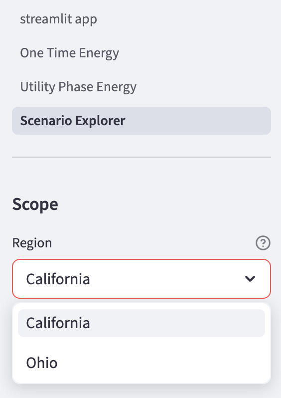

*Tip: leave Region on California for the rest of this walkthrough so your screenshots line up with the defaults shown in this guide.*

---

### Step 2 — Pick a policy preset and the residual band mode

Directly under **Region** you'll find:

- **Policy** — `Baseline` is the default; any presets defined in the region config appear here.
- **Default residual band** — `Default` uses manuscript-anchored ranges; switch to `Customized` to enable your own priors (see Step 7).

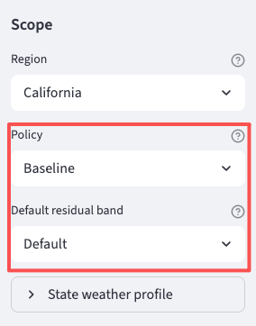

---

### Step 3 — Move the six scenario sliders

Expand **Scenario settings** in the sidebar. Try this sequence and screenshot each one before moving on:

1. Raise **CAV target fraction by 2075** default `0.45`: `0.00` → `0.95`.
2. Raise **STI coverage target by 2075** default `0.50`: `0.00` → `0.95`.
3. Bump **Annual BEV-share growth** default `0.07`: `0.00` → `0.50`.
4. Bump **Annual low-carbon electricity share growth** default `0.05`: `0.00` → `0.30`.
5. Drop **Hardware efficiency doubling time** default `2.80`: `2.00` → `12.00` yr (faster Moore-like gains).
6. Drop **Hardware deployment lag** default `2.00`: `0.00` → `5.00` yr (instant fleet roll-out).

The live deterministic line in Figure A updates instantly after each change.

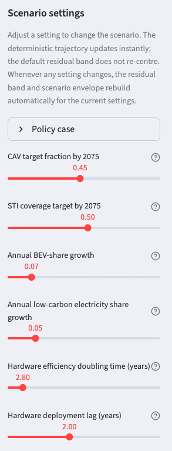

> When you're done experimenting, click **Reset to state defaults** at the bottom of the sidebar to restore the canonical scenario.

---

### Step 4 — Choose the Figure A metric

In the main panel, the first set of toggles under **Figure A** lets you switch what's plotted on the y-axis:

- `Annual CO₂ emissions` (default)
- `Annual energy demand`
- `Both (dual axis)`
- `Cumulative CO₂ emissions`
- `Cumulative energy demand`

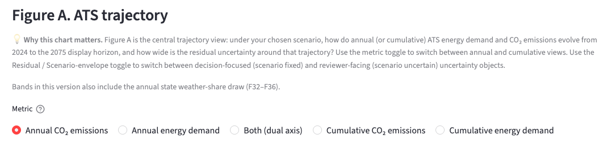

The **Peak year**, **Turning year**, and **IB (τ = 0.5 / τ = 1.5)** KPIs to the right of the chart re-compute for whichever metric you pick.

---

### Step 5 — Residual vs Scenario-envelope uncertainty

The **Uncertainty object** toggle controls *which* uncertainty the shaded band represents:

- **Residual** — your scenario settings are fixed; the band shows only the remaining input/parameter uncertainty. Use this for decision-making once you've committed to a scenario.
- **Scenario envelope** — the scenario settings are *also* sampled. The band is wider; use this when you want a reviewer-facing predictive interval.

Use the **Monte Carlo runs** slider (20 / 80 / 200) to trade resolution for speed.

---

### Step 6 — Inspect the top residual-uncertainty drivers (Figure B)

Below Figure A, **Figure B** ranks every residual parameter by `(p95 − p05) / p50` for a chosen horizon year. Click the **Year** toggle to switch between **2030 / 2050 / 2075** and watch the ranking shift — typically computing power dominates near-term, sensing power mid-century, and grid-side CO₂ intensity at end-of-horizon.

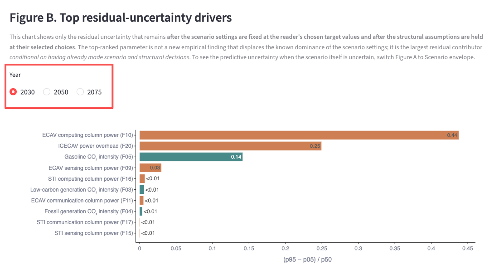

---

### Step 7 — Customize a residual prior

Scroll down to **Residual uncertainty ranges** near the bottom of the Scenario Explorer page. Expand any block (e.g. *ECAV load-model ranges (F09, F10, F11)*) and:

1. Click the **Customized** radio for the factor you want to override.
2. Edit the **support** (lower/upper) and **sigma** values.
3. Watch the **All default ranges active** badge flip from `Yes` to `No`.
4. Figure A's residual band rebuilds automatically when the Monte Carlo refreshes.

To restore the manuscript-anchored priors, click **Reset all to default ranges**.

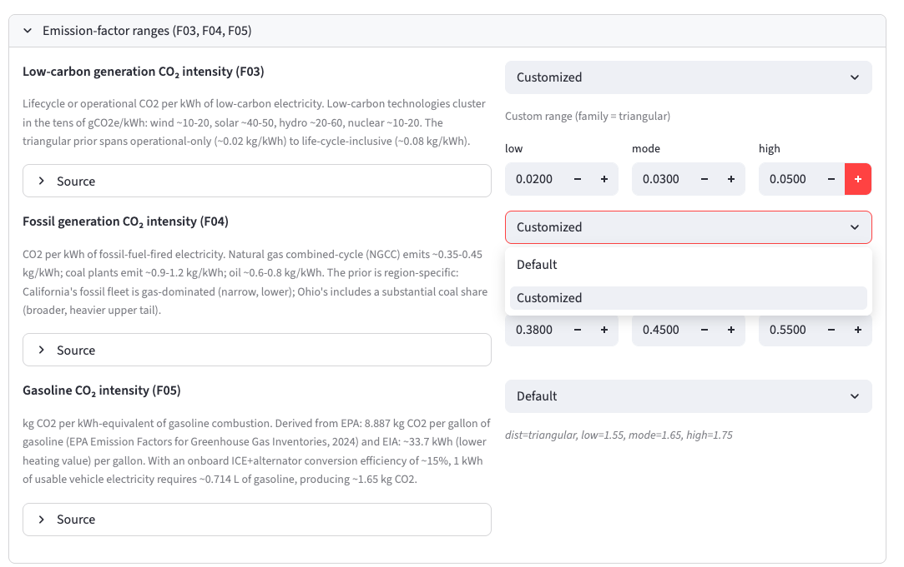
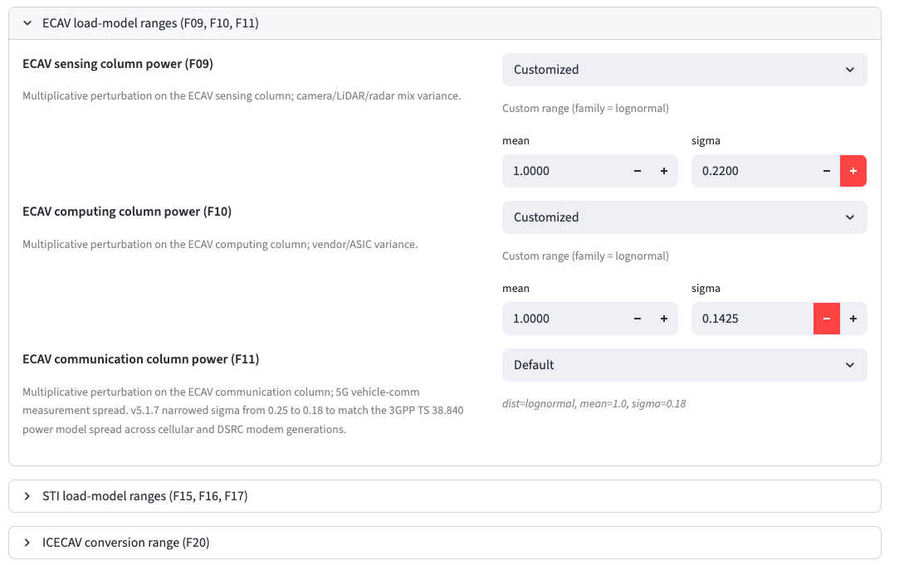

---

### Step 8 — Toggle Figure C with the optional L3 layer

In **Figure C — Layer contribution summary**, tick **Include L3 for reference (conditional on target-setting)** to overlay the scenario-setting layer on top of L1 (emission factors) and L2 (load model). Useful when you want to communicate that scenario choices dwarf residual uncertainty.

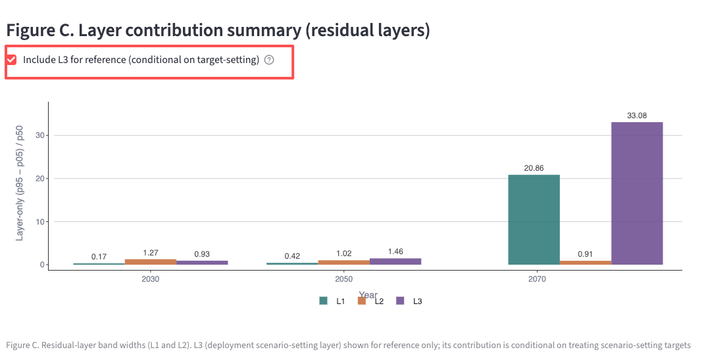

---

### Step 9 — Per-vehicle controls on the Utility Phase Energy page

Switch to **Utility Phase Energy** in the left nav. Try:

- Change **Emission-factor region (config file)** to match what you picked on the Scenario Explorer.
- Switch **CAV duty cycle** between *Personal use (~3 h/day)* and *Robotaxi (~12 h/day)* — the AV-subsystem energy in Figure 1 grows ~4× under robotaxi duty.
- Edit the **ICE propulsion (kWh/yr)** and **BEV propulsion (kWh/yr)** numeric inputs. Whatever you type becomes the propulsion bar 

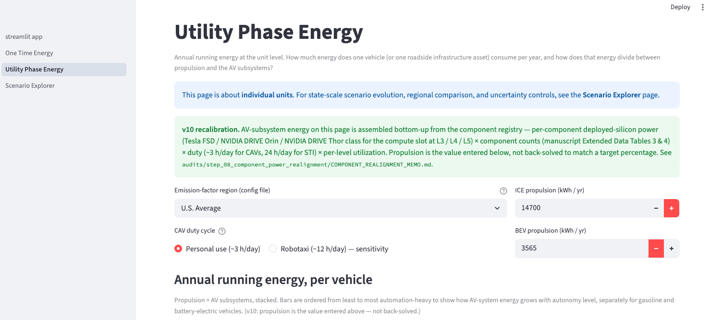

---

### Step 10 — Toggle the One-Time Energy Figure C view

Open **One Time Energy**. In **Figure C — Marginal components across autonomy levels**, switch the **View** toggle between *Component breakdown (default)* and *Total counts only* to compare deployment density vs. energy-weighted view.

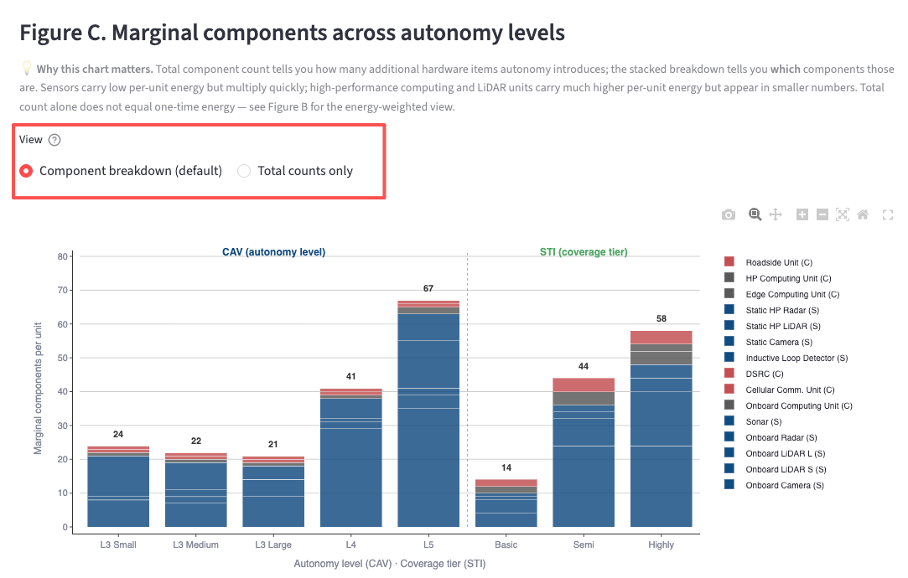

---

### Step 11 — Export anything you see

Every Plotly chart has a small toolbar that appears on hover (top-right of the figure):

- **Camera icon** → download PNG of the current chart.
- **Pan / zoom / autoscale** → inspect details without changing data.

Tables under `▸` expanders can be exported via Streamlit's built-in dataframe menu (top-right of the table on hover) — choose *Download as CSV*.

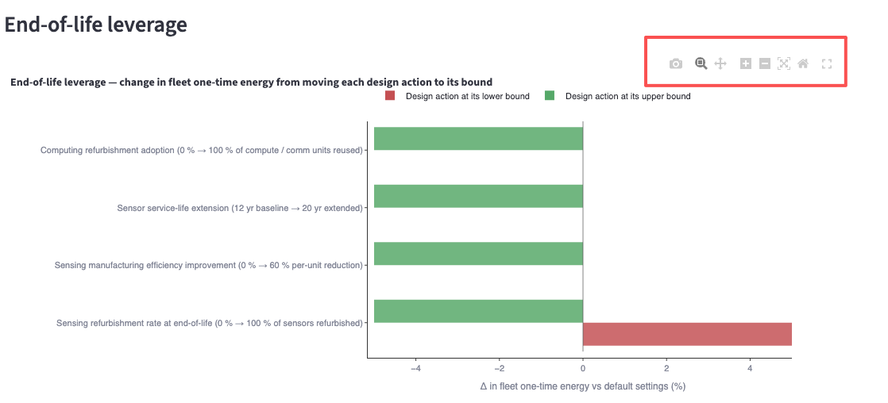

---

## How to Read the Site Together

The three pages map onto the three blocks of the manuscript's uncertainty diagram:

| Site page | Manuscript block | What it answers |
|---|---|---|
| One-Time Energy | Embodied / Lifecycle | What does the hardware cost us *before* it ever drives? |
| Utility Phase Energy | Unit-level operational | What does one CAV or one smart intersection cost per year? |
| Scenario Explorer | Fleet-scale propagation | What is the *state-wide* trajectory of demand and emissions, and how confident are we? |

**Headline finding**: traffic-autonomy expansion shifts the marginal energy cost of road transport **away from vehicles and roadside infrastructure** and **toward AI computing and the electricity that powers it**. The Scenario Explorer's hardware-efficiency doubling time is therefore the single largest scenario-setting lever for 2050 emissions.

---

## Quick Tips

- **Hover** any bar / line for exact values; Plotly's camera icon (top-right of each chart) exports the figure as PNG.
- Tables under "expand" icons are downloadable as CSV via the Streamlit dataframe menu.
- The **Default residual band** in Figure A is *pre-computed* — it does not re-centre when you move a slider. The live deterministic trajectory does. Switch to **Customized** to force a fresh Monte Carlo for your settings.
- All recalibration rationale is in `audits/step_08_component_power_realignment/COMPONENT_REALIGNMENT_MEMO.md`.

---

*Dashboard version: v10. Display horizon: 2075. Modelled states: California, Ohio.*
